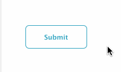

# fix-outline
> ```*:focus { outline: none; }``` done right.

By default, some browsers() add an outline around your shiny buttons when they are clicked:



This is great for [keyboard accessibility](http://webaim.org/techniques/keyboard/), but most users don't use keyboard for navigating. The goal of this library is to provide **best visual experience for most users**, while keeping good keyboard accessibility.

`fix-outline` disables outline until user actually uses keyboard navigation. **It works out of the box with your existing CSS.**

This very small library has no dependencies and supports all modern browsers, including IE8+.

**Note:** *Chromium's behavior to outline buttons on click [is intentional](https://code.google.com/p/chromium/issues/detail?id=305356). To my mind, this library is a good compromise between visual look and accessibility.*

## Install

[](https://nodei.co/npm/fix-outline/)


```bash
npm install fix-outline
```

## Usage

**Remove** all existing global outline rules like these:

```css
*:focus {
  outline: 0;
}
```

Then call `fixOutline()` once in your JS:

```javascript
var fixOutline = require('fix-outline');
fixOutline();
```

Now `outline` is disabled for all focused elements until keyboard navigation is used for the first time.

### Advanced usage

`fixOutline()` automatically adds new CSS rules to your page.
You can disable this behavior by setting `autoCSS` option
to `false`:

```javascript
var fixOutline = require('fix-outline');
fixOutline({
    autoCss: false
});
```

That means you need to add some CSS yourself. For example this rule is added
when `autoCss` is enabled:

```css
body:not(.kb-nav-used) *:focus {
  outline: none;
}
```

## How it works

This is shortly how `fix-outline` works:

* Add new CSS rule which disables outline on elements when .kb-nav-used is not defined for body
* Setup hook, which adds **.kb-nav-used** class to **body** when TAB key is pressed

In other words, outline for elements is enabled
after user uses keyboard navigation for the first time.

Reasoning behind the implementation:

* Enables accessibility only for the ones using it.
* Fast. Does CSS stylesheet modifications only once and removes event listener. [Other implementations](https://github.com/lindsayevans/outline.js/blob/master/outline.js) keep listening for all `mousedown` and `keydown` events.

Usually developers fix this by [setting a global](http://stackoverflow.com/questions/3397113/how-to-remove-border-outline-around-text-input-boxes-chrome) `*:focus { outline: none; }` rule, but **[they shouldn't](http://outlinenone.com/)**.

## Resources and other implementations

* http://outlinenone.com/
* http://a11yproject.com/posts/never-remove-css-outlines/
* https://gist.github.com/jensgro/2470777
* https://github.com/lindsayevans/outline.js


## License

MIT
